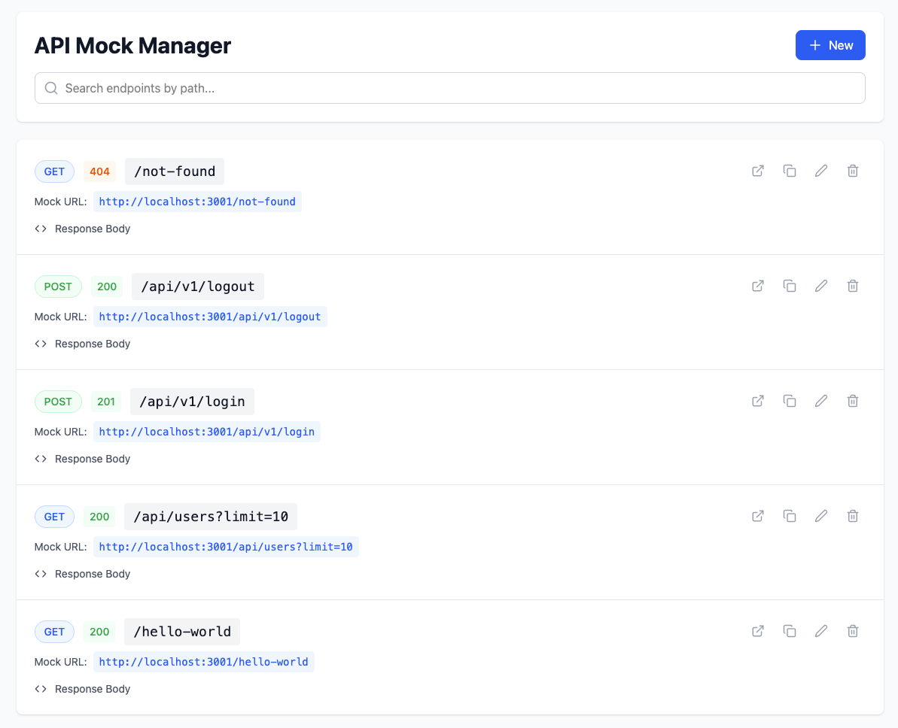

# API Mock Manager

A full-stack application for creating and managing API mocks.



## Features

### Frontend (React)
- Create, edit, and delete mock endpoints
- Configure HTTP method, status code, and JSON response
- JSON editor with formatting and validation
- Search endpoints by path
- Copy endpoint URLs to clipboard
- Test endpoints directly in browser
- Real-time endpoint management via backend management API

### Backend (Node.js + Express + SQLite)
- REST API for endpoint management
- SQLite database for persistence (`api_mocks.db`)
- Dynamic mock endpoint serving (all requests are matched against stored mocks)
- Query parameter support
- Automatic JSON response handling
- CORS enabled for frontend integration

---

## Project layout

```
api-mock-manager/
├─ backend/
│  ├ server.js
│  ├ package.json
│  ├ Dockerfile
│  ├ .dockerignore
│  └ api_mocks.db        <-- SQLite file persisted on host
├─ frontend/
│  ├ package.json
│  ├ Dockerfile
│  ├ docker-entrypoint.sh
│  ├ .dockerignore
│  ├ nginx/
│  │  └ default.conf
│  ├ public/
│  │  └ index.html
│  └ src/
│     ├ main.jsx
│     ├ index.css
│     └ App.jsx          <-- React component with dynamic API_BASE_URL logic
├─ docker-compose.yml
└─ README.md             <-- this file
```

---

## Local setup

### Backend
1. Install
```bash
cd backend
npm install
```
2. Start server:
```bash
# production
npm start

# or development with auto-reload (nodemon)
npm run dev
```
The server listens on port `3001`.

### Frontend
1. Install:
```bash
npm install
```
2. Start:
```bash
npm run dev
```
Open `http://localhost:3000`

---

## Docker

### Prepare the SQLite file
Before `docker-compose up` create an empty sqlite file to ensure the bind mount is a file, not a directory:
```bash
touch backend/api_mocks.db
```

### Setup environment
1. Create `.env` file from the `.env.example`:
```bash
cp .env.example .env
```

2. If you change the `BACKEND_PORT`, make sure to also match `VITE_API_BASE_URL` with the `BACKEND_PORT`.
```env
BACKEND_PORT=3001
FRONTEND_PORT=3000
VITE_API_BASE_URL=http://localhost:3001
```

### Build & start
From repository root (where `docker-compose.yml` sits):
```bash
docker-compose up --build
```

### Stopping and restarting
To stop:
```bash
docker-compose down
```
To rebuild after source changes:
```bash
docker-compose up --build
```
